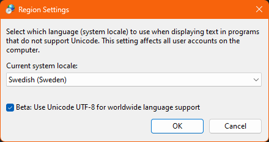

# Character encoding problems in Windows

If you are using a terminal under Windows, sometimes native characters such as åäöÅÄÖ are strange. If you print them and it just works then you are good to go, but if you read åääÅÄÖ using `scala.io.StdIn.readLine` and you get strange charachters back, then you may want to try the solutions below. 

## Problem

It is difficult to print strings with **UTF-8** encoding by default to any terminal on Windows because of Windows default encoding *ANSI* on Windows installations made with **English** as the system locale.

It works to print *ANSI* if the characters are used in the code

```scala
println("ABCabcÅÄÖåäö")
```

But printing characters read using `readLine` even if they are *ANSI* don't work. It prints `'?'` instead.

```scala
scala> scala.io.StdIn.readLine("> ")
> ÅÄÖåäö
val res0: String = ??????
```

## Solutions

First it is good to install the new Windows Terminal, which is better att handling Utf-8 encoding:
* https://learn.microsoft.com/en-us/windows/terminal/install
  
If you still have problems then you need to fiddle with some windows setting as describet below.

### Solution 1

If you are on **Windows 11** or **Windows 10, version 1809** or later.

1. Press `Win + R` and type `intl.cpl`, press enters
2. Switch to **Administrative** tab
3. Click the `Change system locale`
4. Set "Current system locale:" to "Swedish (Sweden)"
4. Enable the `Beta: Use Unicode UTF-8 for worldwide language support`
5. Restart the computer



NOte: Setting **Current system locale** to "Swedish (Sweden)" doesn't change the Windows display language but it sets other encoding defaults to UTF-8 so that you don't need `//> using java-opt -Dfile.encoding=UTF-8` in the test script below.

### Solution 2

Change the codepage **[ terminal/console only ]**

1. Open `regedit`
2. Find `HKEY_LOCAL_MACHINE\Software\Microsoft\Command Processor\Autorun`
3. Change the value of `Autorun` to `@chcp 65001>nul`

If `Autorun` is not present, you need to create a `New String` in the directory.


## Scala test script

Scripts used to test printing and inputing UTF-8 characters


```scala
//> using scala 3.5.1
//> using java-opt -Dfile.encoding=UTF-8
// The UTF-8 java option is only needed when the "Current system locale" is set to "English"

import java.nio.charset.{StandardCharsets as C}

@main def run =
    val s = scala.io.StdIn.readLine("<123ABCÅÄÖåäö> ")
    println(s"You wrote: '$s'")
    val cs =
        Seq(C.UTF_8, C.ISO_8859_1, C.UTF_16, C.UTF_16BE, C.UTF_16LE)
    for c <- cs do
        val otherworldly = String(s.getBytes, c)
        println(s"in other world of $c: '$otherworldly'")
    
    println(s"The bytes: ${s.getBytes().mkString(",")}")
    println(System.getProperty("file.encoding"))
    println(System.getProperty("native.encoding"))
```

## Results

Output of script and terminal commands before and after changing settings

### `[System.Text.Encoding]::Default`

#### Before

Could not go back and check because some setting get permanently changed even if you try to restore them to default.

#### After

```shell
Preamble          :
BodyName          : utf-8
EncodingName      : Unicode (UTF-8)
HeaderName        : utf-8
WebName           : utf-8
WindowsCodePage   : 1200
IsBrowserDisplay  : True
IsBrowserSave     : True
IsMailNewsDisplay : True
IsMailNewsSave    : True
IsSingleByte      : False
EncoderFallback   : System.Text.EncoderReplacementFallback
DecoderFallback   : System.Text.DecoderReplacementFallback
IsReadOnly        : True
CodePage          : 65001
```

### `chcp`

Gets the active code page

#### Before

```shell
Active code page: 437
```

#### After

```shell
Active code page: 65001 // same thing as UTF-8
```

### `Scala` - `Windows Terminal` & `VS Code` No settings changed

```shell
<123ABCÅÄÖåäö> åäö
You wrote: '???'
in other world of UTF-8: '???'
in other world of ISO-8859-1: '���'
in other world of UTF-16: '?????'
in other world of UTF-16BE: '?????'
in other world of UTF-16LE: '?????'
The bytes: -17,-65,-67,-17,-65,-67,-17,-65,-67
UTF-8
UTF-8
```

### `Scala` - `Windows Terminal` BETA UTF-8 settings changed

```shell
<123ABCÅÄÖåäö> åäö
You wrote: 'åäö'     # not using java-opt -Dfile.encoding=UTF-8
# You wrote: 'åäö'      # with using java-opt -Dfile.encoding=UTF-8
in other world of UTF-8: 'åäö'
in other world of ISO-8859-1: 'åäö'
in other world of UTF-16: '쎥쎤쎶'
in other world of UTF-16BE: '쎥쎤쎶'
in other world of UTF-16LE: 'ꗃ꓃뛃'
The bytes: -61,-91,-61,-92,-61,-74
UTF-8
Cp1252
```

### `Scala` - `VS Code` BETA UTF-8 settings changed

```shell
<123ABCÅÄÖåäö> abcåäö
You wrote: 'abc'        # Notice that the "åäö" characters disappears
in other world of UTF-8: 'abc'
in other world of ISO-8859-1: 'abc'
in other world of UTF-16: '慢挀'
in other world of UTF-16BE: '慢挀'
in other world of UTF-16LE: '扡c'
The bytes: 97,98,99,0,0,0
UTF-8
Cp1252
```

## Known Problems

VS Code Terminal won't display the right characters when using **Scala**. The theory is that it has something to do with the **JVM**

## Current versions when this was last investigated 

### Windows

```shell
Edition         Windows 11 Pro
Version         23H2
Installed on    2024-03-02
OS build        22631.4317
Experience      Windows Feature Experience Pack 1000.22700.1041.0
```

### Scala

```shell
Scala code runner version:  1.4.3
Scala version (default):    3.5.1
```

### JDK

```shell
java 21.0.5 2024-10-15 LTS
Java(TM) SE Runtime Environment (build 21.0.5+9-LTS-239)
Java HotSpot(TM) 64-Bit Server VM (build 21.0.5+9-LTS-239, mixed mode, sharing)
```

### VS Code

```shell
Version:    1.94.2 (user setup)
Commit:     384ff7382de624fb94dbaf6da11977bba1ecd427
Date:       2024-10-09T16:08:44.566Z
OS:         Windows_NT x64 10.0.22631
```

### PowerShell

```shell
PowerShell 7.4.5
```

### Windows Terminal

```shell
Version: 1.20.11781.0
```
